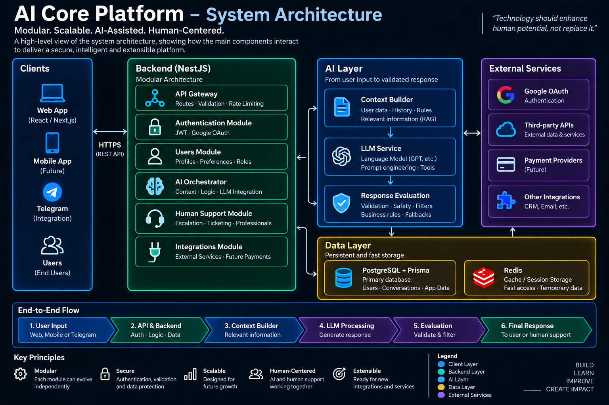
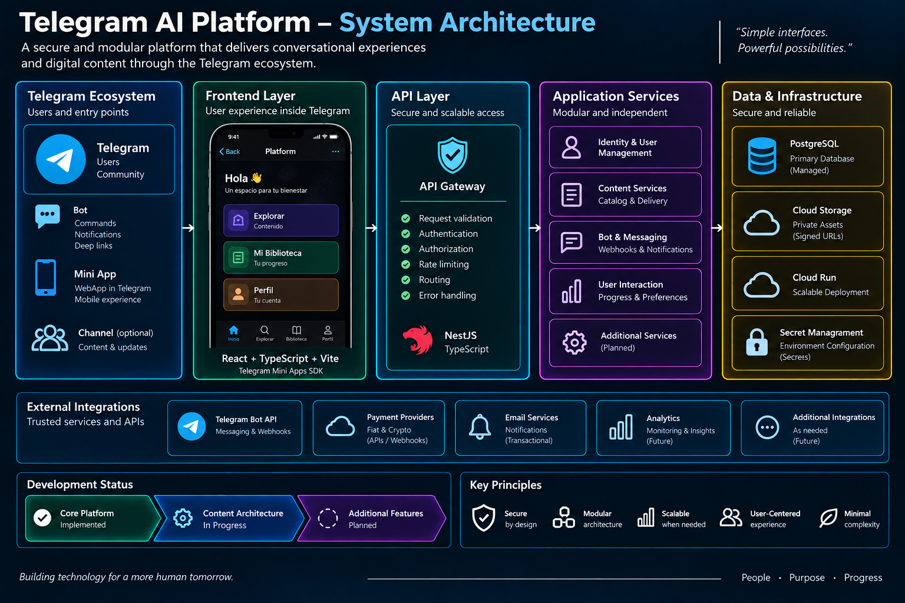

# AI Systems Portfolio

> Building AI-assisted software systems with a focus on backend architecture, security, cloud infrastructure and human-centered technology.

Welcome to my technical portfolio.

I design and develop software systems using AI as an engineering copilot throughout the development process.

I define the problem, architecture, system behavior and technical requirements, while using AI tools to accelerate implementation, debugging, testing, technical research and iteration.

My background in Mechanical Engineering and industrial maintenance strongly influences the way I approach software:

> Understand the complete system, understand how its components interact, identify failure points and then design the solution.
# About Me

I am a Mechanical Engineer with hands-on experience in industrial maintenance and a growing specialization in software systems and artificial intelligence.

My engineering background taught me to understand complex systems from the inside: how components interact, how failures propagate and how to diagnose problems before proposing solutions.

I now apply that same systems-thinking approach to software development.

I have designed and developed projects involving backend architecture, transactional systems, cloud infrastructure, conversational AI and persistent-memory systems, using AI extensively as an engineering copilot.

I am particularly interested in roles where engineering, software and AI intersect.

---

# Technical Skills

### Hands-on Development

**Backend**
- NestJS
- TypeScript
- Python
- FastAPI
- REST APIs

**Data**
- PostgreSQL
- TypeORM
- Prisma
- Transactional data modeling

**AI Engineering**
- LLM integration
- Prompt engineering
- Context management
- Persistent memory
- Structured AI outputs
- Multimodal AI
- AI orchestration

**Cloud & Integrations**
- Google Cloud
- Cloud Run
- Cloud SQL
- Cloud Storage
- Webhooks
- External APIs

**Engineering Concepts**
- Authentication & authorization
- Idempotency
- State machines
- Concurrency control
- Transactional consistency
- Defensive API design

### AI-Assisted Engineering

I regularly use AI tools for architecture exploration, implementation, debugging, testing, technical research and code review.

AI accelerates my engineering process, while system requirements, validation and final technical decisions remain under my responsibility.

### Currently Expanding

- Production observability
- Distributed systems
- Advanced AI evaluation
- RAG architectures
- Scalable cloud infrastructure
---
# Engineering Highlights

A selection of engineering challenges I have worked on while building real systems.

### Transactional Consistency

Designed transactional workflows where multiple operations must remain consistent even under failures, retries or concurrent requests.

**Concepts applied:** database transactions, atomic operations, immutable records and compensating operations.

### Idempotent Systems

Implemented mechanisms designed to prevent repeated requests or external events from producing duplicated operations.

**Concepts applied:** idempotency, unique constraints, external verification and defensive processing.

### State Machines

Built controlled lifecycle transitions for workflows where arbitrary state changes could create inconsistent system behavior.

**Concepts applied:** explicit state transitions, validation and atomic updates.

### External APIs & Webhooks

Integrated backend systems with external providers while accounting for delayed, duplicated or unreliable notifications.

A key principle applied throughout development:

> External notifications are signals. Critical state changes require verification.

### Secure Identity & Authorization

Implemented authentication and authorization mechanisms across different environments, including JWT-based sessions, role-based access and cryptographically verified platform identity.

### Conversational AI Architecture

Built an AI system where the language model operates as one component inside a broader architecture involving:

**Context → State → Rules → LLM → Validation → Response**

This reduces dependence on a single prompt and makes conversational behavior easier to control and evolve.

### Persistent AI Memory

Designed asynchronous memory processing that allows conversational context to persist beyond the immediate model context window while keeping the interactive path lightweight.

### Defensive AI Integration

Implemented structured model outputs and validation mechanisms so malformed or unexpected AI responses do not automatically propagate through the application.

---

These projects have reinforced one principle across my work:

> Reliable systems are not defined by what happens when everything works, but by how they behave when something fails.

# Projects

## 01 — AI Core Platform

A modular backend platform combining user management, transactional operations, digital services, external integrations, human support and AI-assisted experiences.

The project has evolved beyond a traditional AI application into a broader systems-engineering challenge involving transactional consistency, authentication, state management, external APIs and cloud infrastructure.

### Technical areas

- Backend architecture
- NestJS + TypeScript
- PostgreSQL
- TypeORM
- REST APIs
- JWT authentication
- Role-based authorization
- Transactional systems
- Idempotency
- Concurrency control
- State machines
- Webhooks
- External integrations
- Google Cloud infrastructure
- AI / LLM integration
- Security-oriented engineering

### Architecture

### Status

🔒 Source code: Private  
🚧 Active development  
✅ Core transactional architecture implemented  
🧪 External integrations and hardening under continuous validation  
🤖 AI capabilities in development  

[View technical case study](projects/core-platform.md)

---

## 02 — Telegram AI Platform

A separate modular platform built around the Telegram ecosystem.

It combines a Telegram Bot, Mini App, secure identity verification, backend services and a structured digital content architecture.

The system is intentionally isolated from the Core Platform, allowing both projects to evolve independently.

### Technical areas

- Telegram Bot API
- Telegram Mini Apps
- React
- Vite
- TypeScript
- NestJS
- PostgreSQL
- Prisma
- REST APIs
- Webhooks
- Cloud Run
- Cloud Storage
- Secure identity verification
- Cloud deployment

### Architecture

### Status

🔒 Source code: Private  
🚧 Active development  
✅ Telegram foundations implemented  
🟡 Content architecture implemented and under validation  

[View technical case study](projects/telegram-platform.md)

---

## 03 — Humanoid AI Bot

An experimental conversational AI project focused on exploring more natural interactions between users and AI systems.

The project explores areas such as:

- Conversational AI
- LLM integration
- Context management
- Personality and interaction design
- AI-assisted user experiences

A dedicated technical case study will be added as development documentation is prepared.

### Status

🔒 Source code: Private  
🧪 Experimental project  
📄 Public documentation: Coming soon  

---

# AI-Assisted Engineering

AI is deeply integrated into my engineering workflow.

I use AI tools to assist with:

- Architecture exploration
- Code generation
- Debugging
- Refactoring
- Test design
- Failure analysis
- Technical research
- Documentation
- Security review
- Comparing implementation alternatives

AI-generated solutions are not treated as automatically correct.

They are tested, challenged and modified according to the requirements and constraints of the system.

I remain responsible for understanding the architecture, defining requirements, validating system behavior and making final engineering decisions.

---

# Engineering Approach

My engineering process generally follows:

**Understand → Design → Implement → Test → Audit → Correct → Verify**

I am particularly interested in systems where software engineering, AI and real-world operational problems intersect.

The goal of this portfolio is not to expose proprietary source code.

Instead, it demonstrates the engineering problems I have worked on, the technologies I have used and the architectural thinking behind the systems I build.

---

## Repository

This repository contains public technical documentation only.

Implementation details, proprietary business logic, security-sensitive mechanisms and private source code are intentionally excluded.
